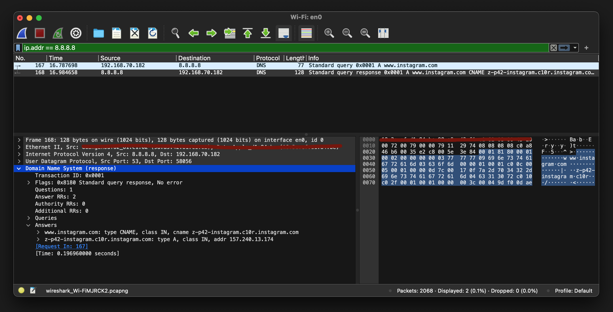

# Node.js DNS Protocol Implementation

This project is an implementation of DNS protocol in Node.js and Typescript for educational purposes. If you are interested in learning how DNS works or wondering how you can implement a DNS resolver, name server, or even a networking protocol in Node.js this is the right project for you to study. 

## Looking up `www.instagram.com` from Google's public DNS

This example shows how to create a DNS query for `www.instagram.com` and send it to Google's public DNS servers.

```javascript
const builder = new DNSMessageBuilder();
const message = builder
  .withHeader(
    new DNSMessageHeader({
      id: 0x01,
      isQuery: true,
      recursionDesired: true,
      qdcount: 1,
    })
  )
  .withQuestions([
    new QuestionEntry({
      qname: 'www.instagram.com',
      qclass: QCLASS.IN,
      qtype: QTYPE.A,
    }),
  ])
  .build();

const encoder = new DNSEncoder(message);
const buffer = encoder.encode();

const client = dgram.createSocket('udp4');

client.on('listening', () => {
  const address = client.address();
  console.log(`listening on ${address.address}:${address.port}`);
});

client.on('message', (message, rinfo) => {
  const hex = message.toString('hex');
  console.log(`response: ${hex}`);
  process.exit(0);
});

client.send(buffer, 53, '8.8.8.8', (err, bytes) => {
  if (err) throw err;

  console.log(
    `query packet: ${buffer.toString('hex')} packet length: ${bytes}`
  );
});
```
## Debugging using Wireshark
You can use Wireshark to see and analyze the actual packets binary data that you send and receive over the network.



## Tests

The best way to learn how to use this project is to study the tests. You can run the tests by running `npm run test`.

### References

1. https://www.rfc-editor.org/rfc/rfc1034
2. https://www.rfc-editor.org/rfc/rfc1035
